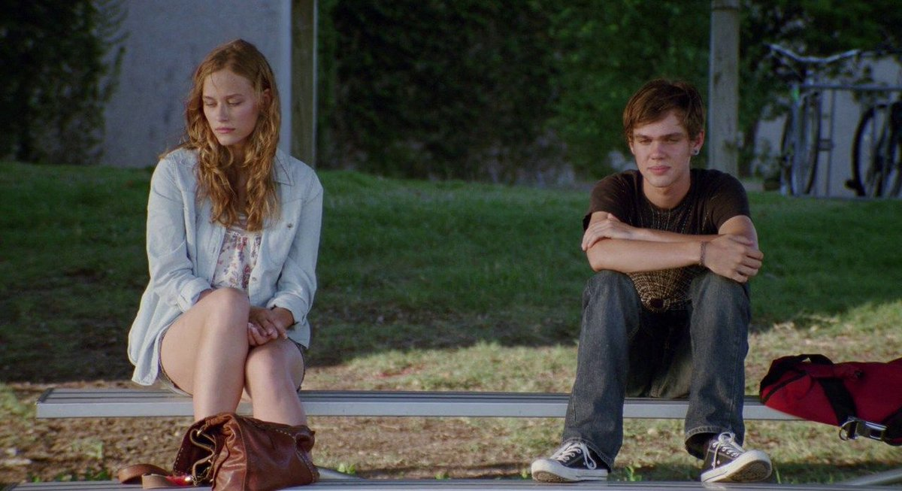

Boyhood
=======

   
   Boyhood [#f1]_

“Boyhood” follows a young boy, Mason, and his family, capturing important family milestones over the course of 12 years. The movie itself was also filmed over the course of 12 years, allowing the viewer to watch the same actors grow up and age in real-time. 

When the story starts, Mason is only 6 years old. By the end of the film, Mason is 18 and starting college. As Mason grows up he watches his mother struggle to pay the bills and go through multiple abusive relationships. Mason’s dad is more estranged, showing up every once in a while and always shocked at how Mason has grown. While written to seem like a deadbeat father, on a deeper level he is just a flawed but deeply loving character. It is this kind of depth Mason’s father has that adds a level of realism to the film that allows the viewer to connect to the story on a much more emotional level.

“Boyhood” does an amazing job at showing the passage of time, despite how awkward it can be, and that is exactly the point. While many films tend to make time pass in a more gracious manner, “Boyhood” is brutally honest about how uncomfortable it can be to grow up. While the storyline may seem simple, just watching a boy grow up, it is made complex by the beautiful imagery accompanying the real-time aging.

“Boyhood” encapsulates the viewer as they watch the actors age naturally. The changes over time seem slow for adult actors such as Mason’s mother and father, but they are there, no matter how subtle. The viewer sees these changes in their own life. Aging is a universal experience, which is part of what makes “Boyhood” so profound and successful. The movie is not fighting time, but embracing it.

“Boyhood” takes an idea that sounds completely mundane and boring and makes it incredibly unique.

.. [#f1] "`Boyhood <https://www.empireonline.com/movies/reviews/boyhood-review/>`_". Sportsphoto/Allstar/Universal Pictures. 2014. Retrieved 2020-12-02.
