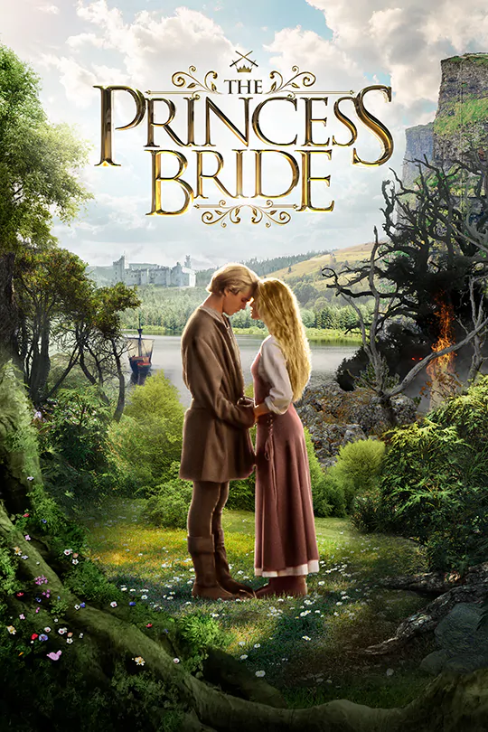

Princess Bride
==============

Princess Bride Movie Poster [#f1]_ 

Plot
----
The Princess Bride is a movie about a story- a little boy is sick in bed for the day, and his grandfather comes to read a story to him in hopes of making the boy feel a little better.
As the audience, we are then taken back in time to the medieval ages, where we meet the love story's main characters, Buttercup and Westly.
Buttercup and Westly fall in love at a young age, but as life goes on, they get separated from one another.
As the years go by, Buttercup catches the local prince's eye, and it becomes Westly's mission to save Buttercup so they can live happily ever after.

About
-----
There are many famous actors in the film, including Cary Elwes, Mandy Patinkin, Andre the Giant, Robin Wright, and Billy Crystal. Although it came out in 1987, the movie's nature and ability to be loved by all generations keep it timeless. One of the best things about this movie is its ability to be loved by the whole family. It is very similar to the movie itself- how the grandfather reads the story to the little boy. There are things in this movie that kids will find funny while including things for adults to find funny, but the children might not understand. Another great part about this movie is its ability to be quoted, while some folks stick to the classic lines like "Inconceivable!" or "As you wish! " I find myself saying the line from the wedding of Buttercup and Humperdinck, "Mawige is what bwings us together." 

Characters
----------

+----------------+-------------------+
| Buttercup      | Robin Wright      |
+----------------+-------------------+
| Westly         | Cary Elwes        |
+----------------+-------------------+
| Inigo Montoya  | Mandy Patinkin    |
+----------------+-------------------+
| Fezzik         | Andre the Giant   |
+----------------+-------------------+
| Miracle Max    | Billy Crystal     |
+----------------+-------------------+

Reviewer's Thoughts
-------------------
I have loved this movie for the majority of my life. This movie will always hold a special place in my heart because it is one of the first movies I can remember watching with my dad and finding it enjoyable. This movie only gets better as I get older, and I can appreciate the talent in the cast as well as some of the lines that went over my head as a child. I am always shocked when I hear someone say they haven't watched it. This movie is one of the best comfort movies to exist, and that is essentially the movie's plot anyway- to make you feel a little bit better. 

Find the movie `here <https://www.20thcenturystudios.com/movies/the-princess-bride>`_.

.. [#f1] "Princess Bride < https://www.20thcenturystudios.com/movies/the-princess-bride>`_". 20th Century Studios. 1987. Retrieved 2020-12-02. 