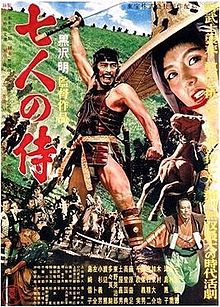

Seven Samurai
=============

   
   Seven Samurai Poster [#f1]_

Read more about this film at the website for `Toho`_.

.. _Toho: https://www.toho.website/kurosawa/10/index.html

:ref:`score`

.. note::
   *Seven Samurai* is an extremely long film at 207 minutes long. This may seem 
   daunting to some, but if you have the time I assure you it is well worth it.

*Seven Samurai* is a film directed by Akira Kurosawa and distributed by Toho 
which was released in 1954. The film centers around a small village in 1500's 
Japan that is being threatened by bandits. The film starts with 4 of the 
villagers going out to seek protection from local samurai, yet they are poor 
and cannot afford it. One samurai, an old and wise samurai by the name of 
Shimada, agrees to help them in their goal of rounding up "at least 4 samurai 
for a village as small as yours" after taking pity on them. The first act of 
the film revolves around this old man rounding up a group of warriors to help 
the village, where almost no action scenes are present at all. 

*Seven Samurai* is one of the most influential films of all time, inspiring the 
way films are made to this day. Even *Star Wars* borrows from the editing style 
of the film to some extent, with the iconic wipe transition of the original 
trilogy being one of Kurosawa's favorites.

The film is shot entirely in black and white, a stylistic choice the director 
uses to great extent in order to add eye catching lighting techniques, as well 
as making it easier to add more depth to a shot. The black and white contrast 
also works well with the setting of the film, that being 1500's Japan, (where 
there was no film at all) but the black and white helps the film feel "older" 
to work with the setting.

It is important to note that this film is entirely in Japanese, with English 
subtitles being the only way to localize it to a English speaking audience, as 
there is no dubbed version. This can make it hard to keep up with what exactly 
is going on at times when many characters are talking at once, but it still has 
a great effect on the audience to hear the acting as it was originally put to 
screen, with bombastic (and sometimes campy) performances.

The balancing of the tone is one of my favorite aspects of *Seven Samurai* 
whilst the first hour or so is more of a lighthearted tale of a group of fun 
and likeable characters simply talking, the latter half of the film focuses 
more on the battle that the samurai must meet and face. It goes from a 
character comedy to a action flick just like that, with both parts being 
equally as engaging.

The characters in the film are some of the most fun and heroic that have been 
put to screen. The "main" character, as there could be many,  Kikuchiyo, is an 
aloof clown who is only pretending to be a samurai, as he never officially 
became one, but when the chips come down he is ready to protect the people of 
the village at any cost. Toshiro Mifune fulfills this role to a great extent. 
Even as a superstar in early Japanese film, his role in *Seven Samurai* is one 
of his most cherished. Another one of my favorites is Kyuzo, a supremely 
gifted swordsman who is also shown to be rather kind to the people of the 
village and his fellow samurai. The characters are funny, heroic, likeable, 
and emotional all at once, being multilayered and certainly not one-note 
stereotypes.

Influence on film
-----------------
* The "leader gathers a team of people to ward off a bad guy" trope
* Editing techniques such as the wipe and long, still shots of battle
* Cutting on action, cutting whilst a character is performing an action
* Wide-angle tracking shots
* Large battle scenes with 40+ extras all choreographed at once

.. _score:

Quick Scores
------------
Individual aspects of the film rated 1 to 10

+------------------------+------------+
| Aspect of film         | Scores     |
+========================+============+
| Cinematography         | 10         |
+------------------------+------------+
| Acting                 | 7          |
+------------------------+------------+
| Music                  | 6          |
+------------------------+------------+
| Script                 | 9          |
+------------------------+------------+
| Overall enjoyment      | 9          |
+------------------------+------------+

.. [#f1] "`Seven Samurai Poster <https://filmartgallery.com/products/the-seven-samurai>`_". Toho Co. 1954. Retrieved 2020-12-2.