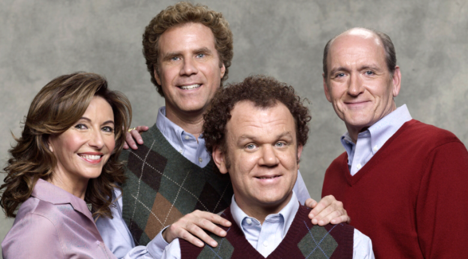

Step Brothers
=============

*Jake Havran* 

Step Brothers is a rated R movie and one of the most humorous movies I have ever watched. Step Brothers main cast consist of Will Ferrell and John C. Reilly and they are comedy because they can make anything awkward into humor quick. This movie is dumb funny because both actors can play silly parts like they are 10 years old and also play the adult scenes when they need to, the combo of these actors is perfect for this movie. The two main characters are Brennan and Dale, who are both around 40 years old and still live with their parents. They soon become stepbrothers as Brennan's mom Nancy marries Dale's dad Robert. As soon as they got married, Dale and Brennan despised each other because they were jealous of each other and they didn't want their parent's lives to be ruined because they are together now. There were many snotty remarks and threatening statements made by Dale and Brennan because they were living the best life, unemployed at home and they were babied their entire lives.

A scene that stands out is the fighting scene when both parents are at work. Brennan did something inappropriate to Dale's drumset when he said specifically not to touch it and everything went downhill from there. Dale is in love with his drumset and he knows exactly if the drumstick has been touched, which is why this scene is a huge deal. At first, they start fighting inside and then they make their way outside, where they have a baseball bat and golf club in their hands, while Brennan's mom is spraying the hose at them. About 15 people are watching this fight happen in the yard while Dale's dad came rushing home from work. Then boom. Dale and Brennan knock each other out with the golf club and baseball bat.

The next day, Brennan and Dale are forced to get jobs by their parents. As they have never been employed and have no clue what to expect, they mess around at every interview and neither one gets hired. That night, Robert and Nancy tell Brennan and Dale that they are selling the house and will be traveling the world in their retirement. The following scene is extremely funny scene because as Nancy and Robert attempt to sell the house, Brennan and Dale do everything they can to stop neighbors from moving in. One of the things they did was pretend that Brennan was dead on the floor and it scared the neighbors away instantly. Another thing they did was dress up as KKK members and the neighbors were haunted right away and left. Later that night, it was Brennan's brother Derek's birthday and Dale and Brennan made a music video on Robert's love of his life, his boat. They wanted to showcase their singing skills because they have always wanted to be in a band together, but everything goes into turmoil, as they wreck his boat, and Robert almost had a heart attack.

Robert and Nancy tell Brennan and Dale that they are having a divorce, and they go ballistic. They both start crying and asking if it is their fault and Robert eventually yells back, "it is directly your fault, you beat me up in your sleep, and worst of all you made Nancy and I resent each other". After this, Dale and Brennen go their separate ways but eventually meet up again at the end of the movie at the Catalina Wine Mixer where Brennan's brother Derek works at. Dale was also there and it was a dream come true situation. Brennan got the opportunity to sing while Dale played the drums, and they got reunited after some time away, which won their friendship back. Also, Nancy and Robert saw how happy they were together and then got back together and ended up building a treehouse from the broken boat.

.. note:: This movie is one of my favorites because it is humorous most of the movie and it is a very upbeat movie. I could watch this movie over and over and it would not get old because it gets funnier every time I watch it. There are very few actors that could have pulled this movie off in my opinion, these actors did it phenomenally. I gave this movie a 9.5 out of 10 and it is well worth it because of the perfect storyline and acting that the movie gave the viewers.

`This is the trailer link for the movie <https://www.imdb.com/title/tt0838283/?ref_=fn_al_tt_1>`_

   Step Brothers Movie [#f1]_

**Favorite Quotes**

* "Did we just become best friends?" -Brennan
* "You don't even look good when you're singing." -Derek
* "I'm Dale, but you have to call me Dragon." -Dale
* "That's so funny the last time I heard that I laughed so hard I fell off my dinosaur." -Dale
* “Do you wanna go do karate in the garage?” -Brennan

=============  =====  ======  ======== =============
Movie          Rated  Time    My Rate  Year Released
=============  =====  ======  ======== =============
Step Brothers  R      1h 46m  9.5/10            2008
=============  =====  ======  ======== =============

.. [#f1] "`Step Brothers <https://www.indiewire.com/2017/06/sony-clean-version-initiative-step-brothers-seth-rogen-1201838709/>`_". Indie Wire. 2017. Retrieved 2017-06-07. 

