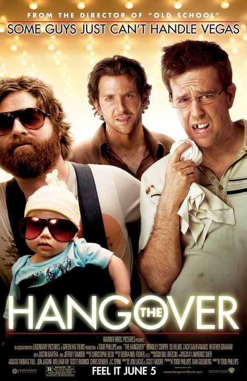

The Hangover
============

*Jake Havran*

The Hangover is also an excellent comedy that makes you laugh for the entire movie. This movie is rated R and for very obvious reasons throughout the film. The cast in The Hangover is hilarious, which includes Bradley Cooper who is Phil, Zach Galifianakis who is Alan, Ed Helms who is Stu, Ken Jeong who is Mr. Chow, Justin Bartha who is Doug, and Rob Riggle. This movie starts with the four buddies, Stu, Alan, Doug, and Phil who want to go to Vegas two days before Doug's wedding. Doug's wedding means a lot to him because he knows there is something special there. Stu's relationship at the moment is very stressful because his wife controls him every second. Alan is still living with his parents and he is single. Lastly, Doug's marriage is not as he would like because he is stressed when he is around his wife. They planned on only staying for 24 hours, but things took a different route as Alan slipped something in everyone's drink the night they got there.

Alan slipped a Rohypnol into everybody's drink when they were taking shots to congratulate Doug's wedding, but he thought it was ecstasy. The next day, they all end up in a luxury villa at Caesars Palace and have no clue what had happened. Hungover and tired, they look around to see Doug missing, which is not good. They also find a tiger, a baby, and a missing tooth from Stu. Alan thinks this whole thing is a comedy because he doesn't have very much common sense. They use every single clue from their pockets and surroundings to backtrack everything that happened and could have happened. As they get more clues and evidence, they make some shocking discoveries about what happened. This scene is the funniest because of Stu's personality and also about his wife. Stu finds out that he got married to a stripper in Vegas and the baby they found in the room was hers. Stu is freaking out the entire time because he said he cheated on his soon to be wife, and he also gave her the ring that he was going to give to his girlfriend. Stu had to lie about going to Vegas and told her it was for business, and she keeps track of his credit card purchases and she stalks him so Stu has no freedom at all.

They eventually found out that they stole Mike Tyson's tiger and Tyson knocked out Alan in front of Stu and Phil. The three guys still have no clue where Doug is so they are searching everywhere, including stealing a cop car and looking, which ends up hurting them in the future. Later on, Mr. Chow who knows Alan shows up and demands $80,000 for him to return Doug to them. The three of them go to the casino and because of Alan's card reading ability in blackjack, they ended up winning $82,400 and giving the money to Mr. Chow. However, this was a black guy named Doug that sold Alan the Rohypnol and then everything came together right after that. As Phil grabbed his cell phone as called Doug's soon to be wife to tell her they can't find Doug, it all came together to Stu. Doug talked about how those drugs make you end up on the floor but he doesn't why the nickname is roofies, and Stu made the correlation. They drove back to the hotel and found Doug on the top of the building sleeping, and luckily enough for them, they had winning chips from the casino along with it. They drove back just in time for the wedding and it happened in the most adventurous way. After Doug got married, Stu's girlfriend confronted him about going to Vegas instead of going on a business trip, and they yelled at each other for a while until she said the relationship was over. Phil never cared for his girlfriend and was extremely happy that they broke up. The Hangover never had any dull moments because they were always on the move and in every scene some tasks needed to be accomplished, whether they liked it or not. 

.. Note:: This is easily a top 3 movie in my mind because of the plot and fast-paced storyline that took place in Vegas. Vegas is a place that many people want to go to and live it up while you spend a lot of money. I could rewatch this movie every week because Alan makes the story funny with his remarks and statements, and he has an opinion about almost everything. This is the first Hangover movie and there is also The Hangover II and The Hangover III, but this one is the best because it is the original. This movie is an all-time classic.

=============  =====  ======  ======== =============
Movie          Rated  Time    My Rate  Year Released
=============  =====  ======  ======== =============
The Hangover   R      1h 48m  9.6/10            2009
=============  =====  ======  ======== =============

`This is the trailer link for the movie <https://www.imdb.com/title/tt1119646/>`_ 

   The Hangover [#f2]_

**Favorite Quotes** 

* "You are literally too stupid to insult" -Stu
* "Gambling? Who said anything about gambling? It’s not gambling when you know you’re going to win. Counting cards is a foolproof system." -Alan
* "Hey, bro? You mind putting on some pants? I find it a little weird I have to ask twice." -Phil
* "Don’t you think it’s strange that you’ve been in a relationship for three years and you still have to lie about going to Vegas?" -Phil
* "I want you to know, Doug, I’m a steel trap. Whatever happens tonight, I will never, ever, ever, speak a word of it." -Alan

.. [#f2] "`The Hangover <http://www.impawards.com/2009/hangover.html>`_". Crew Creative Advertising. 2009. Retrieved 2009-04-24. 

