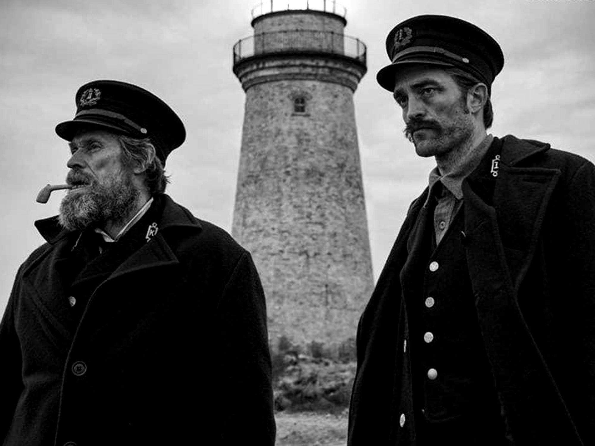

The Lighthouse
==============

   The Lighthouse promotional image [#f1]_

Check this movie out at the website for `A24`_.

.. _A24: https://a24films.com/films/the-lighthouse

:ref:`scores`

*The Lighthouse* is a film directed by Robert Eggers and produced and 
distributed by A24. The film centers on two lighthouse keepers, Thomas Wake 
and Ephriam Winslow, and their stay on a faraway island from shore, tending to 
a lighthouse. The film is shot entirely in black and white, with a 4:3 aspect 
ratio which may be a turn off for some at first glance, but it actually adds 
greatly to the tone of the movie, perfectly matching the gloomy and dark 
weather of a deserted Atlantic island.

As their stay on the island goes on, they eventually realize that they have 
been passed over for pickup off the island due to a mighty storm making travel 
by sea dangerous and are stranded. This is the main driving conflict of the 
movie, with these two lighthouse keepers slowly losing their marbles and 
running low on food (and booze, more importantly to them). 

The film continually builds tension throughout, with events on the island 
starting off a little strange to boiling over to **absolutely bonkers** once 
the climax point is reached. Eprhiam continually falls deeper and deeper into 
a paranoid state as he continues to work on the island, seeing nothing short 
of his boss on the island transform into a sea monster and believing the light 
of the lighthouse to be some great deity.

Although it is billed as something as a horror movie, it really is more of a 
suspenseful dark comedy, perfectly balancing the tone between fart jokes and 
tension you could cut a knife with. This leads the viewer to be either on the 
edge of their seat or laughing along.

Willem Dafoe and Robert Pattinson both give great performances as Thomas Wake 
and Ephriam Winslow, respectively. Willem Dafoe perfectly encapsulates the 
salty dog, almost parody like, sailor man, whilst Robert Pattinson does a good 
job playing the meek subordinate.

The cinematography of the film constantly focuses on the environment the two 
lighthouse keepers are on, with many shots of the weather and the waves to keep
the viewer in the know about just how bad the situation is. For a movie that 
is set entirely on one island, what you see on screen never bores you, as the 
shots of even the stone tower that is the lighthouse are shot creatively.

.. _scores:

Quick Scores
------------
Indivual aspects of the film rated 1 to 10

+------------------------+------------+
| Aspect of film         | Scores     |
+========================+============+
| Cinematography         | 9          |
+------------------------+------------+
| Acting                 | 10         |
+------------------------+------------+
| Music                  | 7          |
+------------------------+------------+
| Script                 | 8          |
+------------------------+------------+
| Overall enjoyment      | 9          |
+------------------------+------------+

.. [#f1] "`The Lighthouse promotional image <https://www.vox.com/culture/2019/10/15/20914097/robert-eggers-lighthouse-interview-witch>`_". A24. 2019. Retrieved 2020-12-2.